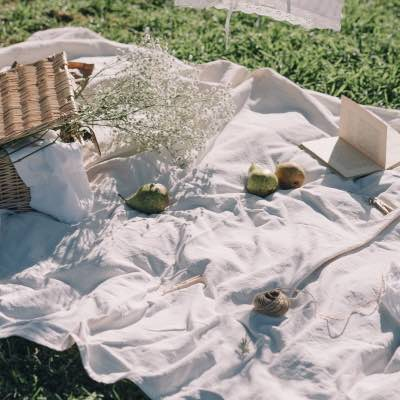
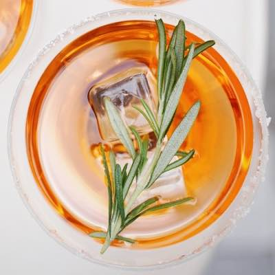
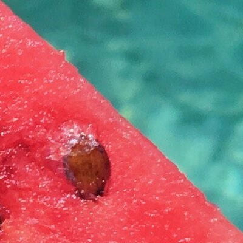
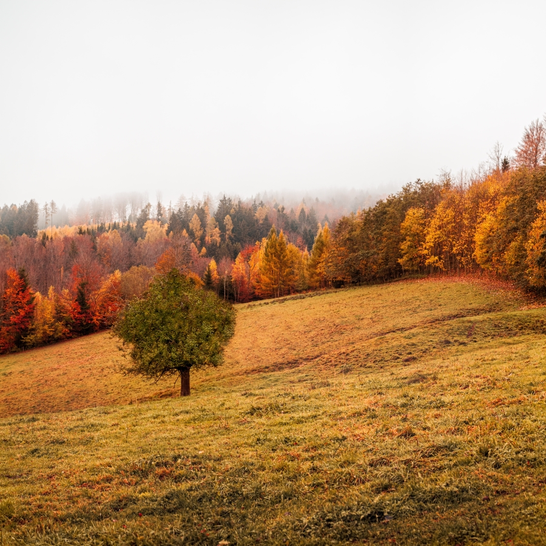
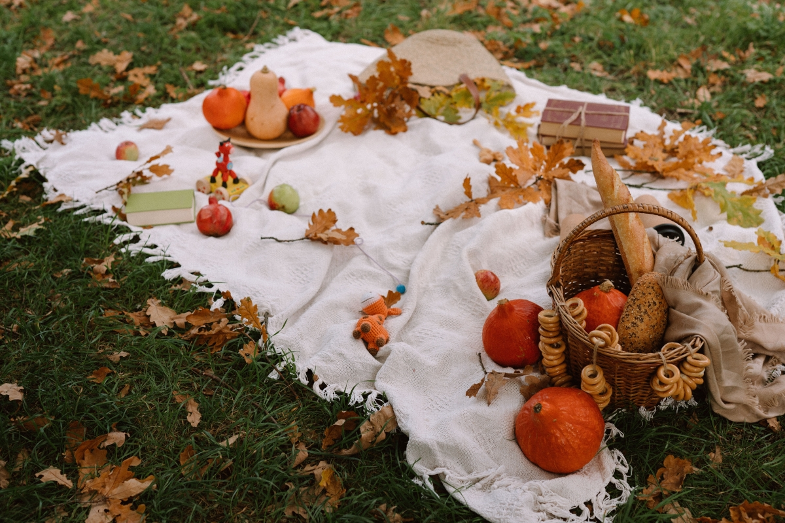

# Portfolio 2
## Personal portfolio website

Including completed tasks:
- Build the HTML structure of the website, including the navigation bar, sections, and footer.
- Apply CSS styling to create an attractive and responsive design. 
- Implemented JavaScript functionality:

    a) smooth scrolling ```[scrollIntoView() method]```
    - defined 2 buttons one of which is a lottie animation. Used BodyMovin (After Effects extension) to export it as JSON.

    b) form validation ```[if statement]```

    c) interactive elements ```[prompt() method / IntersectionObserver]```

    d) mobile menu with toggle functionality
- Publish your portfolio website online -> https://portfolio.danielstoychev.com/ 

## To-Do List Application
Including completed tasks:
- Design the user interface for the to-do list application.
- Implement the HTML structure for the list and task items.
- Apply CSS styling to create an intuitive and visually pleasing interface.
- Use JavaScript to handle user interactions, such as adding new tasks, marking tasks as completed, and editing tasks. 
- Store the to-do list data in the browser's local storage for persistence across
page reloads. Methods used:

```bash
getElementById()
querySelector()
getItem()
remove()
appendChild()
createElement()
preventDefault()
localStorage.setItem()
localStorage.getItem()
localStorage.clear()
(window) confirm()
```
- Adding tasks with a push of a button (Enter):

```bash
inputBox.addEventListener("keypress", function(event) { //action upon pressin ENTER
    if(event.key === "Enter") {
        event.preventDefault();
        document.getElementById('hidden-mobi').click();
    }
});
```
### Comments and code review
```bash
const inputBox = document.getElementById('input-box');
const listContainer = document.getElementById('list-container');

function addTask() {
    if(inputBox.value === '') {
        alert ("You must write something");
    }
    else{
        let li = document.createElement("li");
        li.innerHTML = inputBox.value;
        listContainer.appendChild(li);
        let span = document.createElement("span");
        span.innerHTML = '\u00d7';
        li.appendChild(span);

    }
    inputBox.value = ""; //clears the test after task is added
    storeData(); //stores the data in the browser
}
```
#### if/else statement for adding the task^:

   a) it checks the value of the input and throws and error if it is empty

   b) creates HTML 'li' item and sets the value from the inputBox to it 

   c) appends the newly created 'li' element to the container
   d) creates 'span' element and assigns 'x' character

   e) appends the span' element to the 'li' element

   f) after else{ } completes inputBox is cleared so new task can be added

   g) executes storesData() function for storing data in the browser
```bash
listContainer.addEventListener("click", function(e) {
    if(e.target.tagName === "LI") {
        e.target.classList.toggle("checked");
        storeData();
    }
    else if(e.target.tagName === "SPAN") {
        e.target.parentElement.remove();
        storeData()
    }
},false);
```
#### addEventListener attached to the listContainer 'ul', designed to click on elements inside^:
a) if cklicked on task exequtes toggle of 'checked' class defined in todo.css

b) executes storesData() 

c) if cklicked on it 'X' parentElement 'li' is removed

d) executes storesData()

e) appends the span' element to the 'li' element

f) after else{ } completes inputBox is cleared so new task can be added

g) executes storesData() function for storing data in the browser
```bash
function storeData() {
    localStorage.setItem("data", listContainer.innerHTML);
}

function showData() {
    listContainer.innerHTML = localStorage.getItem("data");
}
```
#### stores data in browser local storage and shows it when showData() is called^
```bash
function del() {
    if (confirm("All tasks will be removed! Are you sure you want to terminate this list?")) {
        localStorage.clear();
        const ul = document.querySelector('ul');
        ul.innerHTML = '';
    }
    else {}
}
```
#### after confirmation, uses the localStorage.clear() method to clear the 'ul' data^
```bash
inputBox.addEventListener("keypress", function(event) { //action upon pressin ENTER
    if(event.key === "Enter") {
        event.preventDefault(); // prevent default actions of the Enter key
        document.getElementById('hidden-mobi').click();
    }
},false);

showData();
```
#### assignes an addEventListener to the inputBox to "listen" for the Enter key and excutes click() action of the button with id='hidden-mobi' (onclick="addTask())^


## Create an Image Gallery with Filtering
Including completed tasks:
- Gather a set of images and categorize/tag them accordingly.
`[li and data-filter]`
- Create the HTML structure for the image gallery, including thumbnails and
filtering options.

`[data-item]`
- Apply CSS styles to showcase the images attractively and arrange them in a
grid layout.
- Use JavaScript to implement the filtering functionality, allowing users to view
images based on selected categories/tags.
- Incorporate lightbox functionality to display larger versions of the images
when clicked.

### Comments and code review

```bash
<div class="btnContainer">
			<ul>
				<li class="list active" data-filter="all">Show All</button>
				<li class="list" data-filter="spring">Spring</button>
				<li class="list" data-filter="summer">Summer</button>
				<li class="list" data-filter="autumn">Autumn</button>
				<li class="list" data-filter="winter">Winter</button>	
			</ul>		
		</div>
```
#### defines unordered list with 5 data filters^

```bash
<div class="images">
				<div class="item" data-item="autumn" onclick="openModal();currentSlide(1)"><div class="overlay"><span></span></div></div>
				<div class="item" data-item="spring" onclick="openModal();currentSlide(2)"><div class="overlay"><span></span></div></div>
				<div class="item" data-item="winter" onclick="openModal();currentSlide(3)"><div class="overlay"><span></span></div></div>
				<div class="item" data-item="summer" onclick="openModal();currentSlide(4)"><div class="overlay"><span></span></div></div>
				<div class="item" data-item="summer" onclick="openModal();currentSlide(5)"><div class="overlay"><span></span></div></div>
				<div class="item" data-item="summer" onclick="openModal();currentSlide(6)"><div class="overlay"><span></span></div></div>
				<div class="item" data-item="summer" onclick="openModal();currentSlide(7)"><div class="overlay"><span></span></div></div>
				<div class="item" data-item="autumn" onclick="openModal();currentSlide(8)"><div class="overlay"><span></span></div></div>
				<div class="item" data-item="autumn" onclick="openModal();currentSlide(9)"><div class="overlay"><span></span></div></div>
				
				<div class="item" data-item="spring" onclick="openModal();currentSlide(10)"><div class="overlay"><span></span></div></div>
				<div class="item" data-item="winter" onclick="openModal();currentSlide(11)"><div class="overlay"><span></span></div></div>
				<div class="item" data-item="spring" onclick="openModal();currentSlide(12)"><div class="overlay"><span></span></div></div>
				<div class="item" data-item="winter" onclick="openModal();currentSlide(13)"><div class="overlay"><span></span></div></div>
				
</div>
```
#### parent and child containers (including thumbnails) showed outside Modal^
```bash
<div class="modal-content">

				    <div class="mySlides" data-item="autumn">
						
					</div>
					<div class="mySlides" data-item="spring">
						
					</div>
					<div class="mySlides" data-item="winter">
						
					</div>
					<div class="mySlides" data-item="summer">
						
					</div>
					<div class="mySlides" data-item="summer">
						
					</div>
					<div class="mySlides" data-item="summer">
						
					</div>
					<div class="mySlides" data-item="summer">
						
					</div>
					<div class="mySlides" data-item="autumn">
						
					</div>
					<div class="mySlides" data-item="autumn">
						
					</div>
					<div class="mySlides" data-item="spring">
						
					</div>
					<div class="mySlides" data-item="winter">
						
					</div>
					<div class="mySlides" data-item="spring">
						
					</div>
					<div class="mySlides" data-item="winter">
						
					</div>

</div>
```
#### Modal HTML structure^
======================
```bash
for (let i = 0; i<list.length; i++){
	list[i].addEventListener('click', function(){
		for(let j = 0; j<list.length; j++){
			list[j].classList.remove('active')
		}
		
		this.classList.add('active');

		let dataFilter = this.getAttribute('data-filter');

		for(let k = 0; k<item.length; k++){
			item[k].classList.remove('active');
			item[k].classList.add('hide');

			if(item[k].getAttribute('data-item') == dataFilter || dataFilter == 'all'){
				item[k].classList.remove('hide')
				item[k].classList.add('active')
			}
		}
	})
}
```
#### handles the filtering^
   a) iterates through an array of list elements

   b) For each list element, it adds a click event listener using addEventListener. When a list element is clicked, the attached function is executed 

   c) the click event handler function

- first removes the 'active' class from all list elements
- then, it adds the 'active' class to the clicked list element. 
- it retrieves the value of the data-filter attribute from the clicked list element
- go through the 'item' list one more time
     
     -- for each item element, it removes the 'active' class and adds the 'hide' class
     
     -- checks whether the data-item attribute of the item element matches the dataFilter value obtained from the clicked list element or if dataFilter is 'all'. If there's a match or if dataFilter is 'all', it removes the 'hide' class and adds the 'active' class to the item element, making it visible

```bash
function openModal() {
  	const zoomModal = document.getElementById('myModal');
  	zoomModal.style.display = "block";
}
```
#### open Modal function by setting its display to 'block'^
```bash
function closeModal() {
 	document.getElementById("myModal").style.display = "none";
 }
 ```
#### close Modal function by setting its display to 'none'^
 ```bash
 const	modalOverlay = document.querySelector('.modal');
 modalOverlay.addEventListener('click', (event) => {
 	if (event.target === modalOverlay) {
 		closeModal();
 	}
 })
 ```
 #### attach click event listener to the modal overlay to close the modal^

```bash
let slideIndex;

function currentSlide(n) {
  showSlides(slideIndex = n);
}

function showSlides(n) {
  let m;
  let slides = document.getElementsByClassName("mySlides");
  for (m = 0; m < slides.length; m++) {
      slides[m].style.display = "none";
  }

  slides[slideIndex-1].style.display = "block"; 

}
```
 #### attach click event listener to the modal overlay to close the modal^

 a) Declares a variable named 'slideIndex' without initializing it with a specific value
 
 b) The 'currentSlide(n)' function
 

 - takes a parameter 'n', which represents the index of the slide that needs to be displayed
 - it calls the 'showSlides()' function and assigns the value of 'n' to 'slideIndex'. This effectively sets the 'slideIndex' to the desired slide index and displays that slide.
  c) The 'showSlides(n)' function
  
  - initializes a variable 'm' that will be used for looping through the slide elements
  - gets all the elements with the class name "mySlides" 
  - loops through all the slide elements and sets their style.display property to 'none'
  - displays the slide with the index 'slideIndex-1' (adjusting for zero-based indexing) by setting its style.display property to 'block'. This makes the selected slide visible while hiding the others.
  

## Home Page Design Idea

https://www.storiesforgood.org/


## Used Languages

- HTML
- CSS
- JavaScript


## Run Locally

Clone the project

```bash
  git clone https://github.com/daniel-stoychev/portfolio2
```

Go to the project directory

```bash
  cd my-project
```

Replace server paths with local ones


## 🔗 Links
[](https://portfolio.danielstoychev.com/)


[](https://portfolio.danielstoychev.com/todo.html)

[](https://portfolio.danielstoychev.com/gallery.html)


## Screenshots


## Authors

- [@DanielS](https://github.com/daniel-stoychev)


## Feedback

If you have any feedback, please reach out to me at daniel.stoychev@siteground.com


